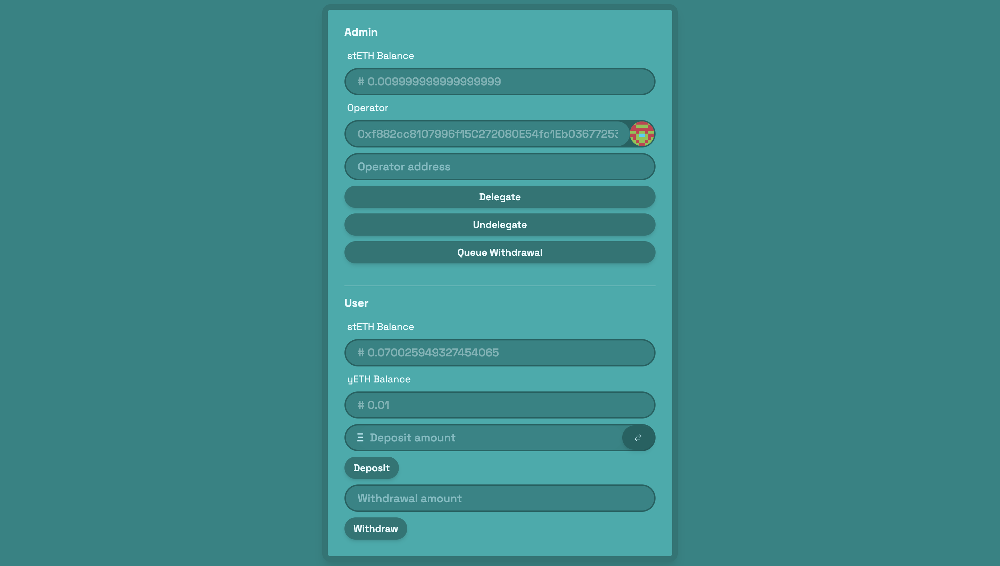

# Yield | Liquid Restaking Protocol

A protocol which enables users to stake **LIDO's stETH** into EigenLayer to earn extra rewards. The system takes stETH deposits and mints the right amount of **Yield Token(yETH)** based on the user's deposit, taking in consideration the total assets in the system and their appreciation over time based on staking rewards. Users can also withdraw their staked ETH but only after it has been withdrawn from EigenLayer by the admin. 

The admin, A **Safe MultiSig Wallet**, controls features such as pausing Yield Token transfers, withdrawing stETH from EigenLayer, delegating and undelegating operators.

<p align="center">
      
</p>

## Environment Setup

Before you begin, you need to install the following tools:

- [Node (v18 LTS)](https://nodejs.org/en/download/)
- Yarn ([v1](https://classic.yarnpkg.com/en/docs/install/) or [v2+](https://yarnpkg.com/getting-started/install))
- [Git](https://git-scm.com/downloads)

Then download the challenge to your computer and install dependencies by running:

```sh
git clone https://github.com/ValentineCodes/yield.git
cd yield
yarn install
```

> In the same terminal, deploy contracts to Holesky testnet

Must set the enviromnent variables in foundry as specified in `.env.example` and the signers in `Deploy.s.sol`

```sh
yarn deploy:verify
```

> in a second terminal, start your frontend:

```sh
yarn start
```

📱 Open http://localhost:3000 to see the app.

> In a third terminal window, run your local backend server:

```bash
cd yield
yarn backend-local
```

---

## Configure Owners 🖋

🔏 The first step is to configure the owners, who will be able to propose, sign and execute transactions.

You can set the signers in the frontend, using the "Owners" tab:


In this tab you can start your transaction proposal to either add or remove owners.

> 📝 Fill the form and click on "Create Tx".


This will take you to a populated transaction at "Create" page:


> Create & sign the new transaction, clicking in the "Create" button:


You will see the new transaction in the pool (this is all offchain).

You won't be able to sign it because on creation it already has one signature (from the frontend account).

> Click on the ellipsses button [...] to read the details of the transaction.


> ⛽️ Give your account some gas at the faucet and execute the transaction.

☑ Click on "Exec" to execute it, will be marked as "Completed" on the "Pool" tab, and will appear in the "Multisig" tab with the rest of executed transactions.


## Transfer Funds 💸

> You'll need to fund your Multisig Wallet

> You can find the address of the Multisig in the "Multisig" and "Debug Contracts" tabs.

> Create a transaction in the "Create" tab to send some funds to one of your signers, or to any other address of your choice:


🖋 This time we will need a second signature (remember we've just updated the number of signatures required to execute a transaction to 2).


> Switch account and sign the transaction with enough owners:


(You'll notice you don't need ⛽️gas to sign transactions).

> Execute the transaction to transfer the funds:


## Delegate and Undelegate an Operator 🤲

<p align="center">
      
</p>

🖋 This will take you to the Pool to sign and execute the transaction

## Queue Withdrawal ⏳

🖋 Withdrawals on EigenLayer take a while to complete. Queued withdrawals will appear like this 👇 after being executed.

<p align="center">
      
</p>

## Complete Withdrawal ⌛️

🖋 After the `minWithdrawalDelayBlocks`(currently **10**) is passed from the time of queue execution, You can complete withdrawal

<p align="center">
      
</p>

## Deposit stETH 💰

🖋 You can deposit stETH into EigenLayer and get some yETH token

<p align="center">
      
</p>

(This will fail if there's no delegated operator in the system)

## Withdraw stETH 🤑

🖋 You can withdraw your staked stETH by burning your specified yETH tokens

<p align="center">
      
</p>

(This will fail if admin has not completely withdrawn staked stETH from EigenLayer)
